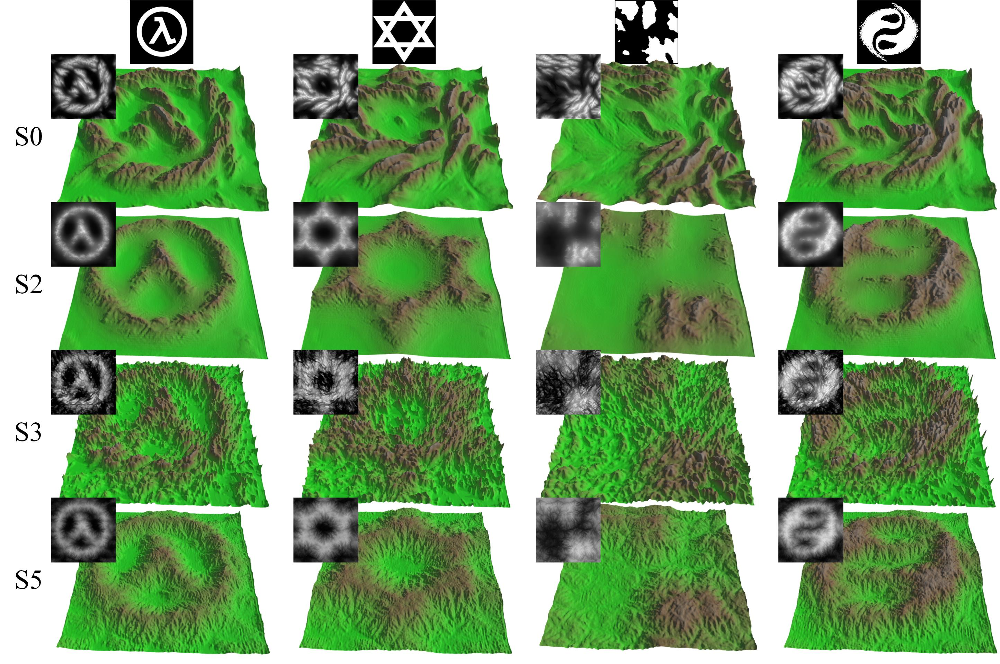
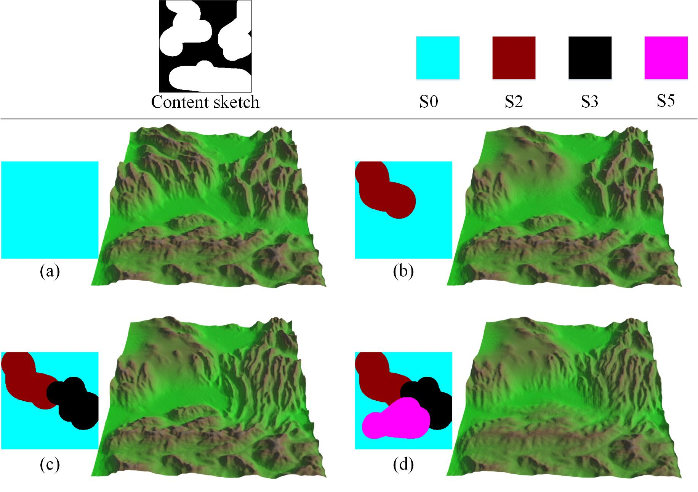

# multi-style-terrain-authoring

Authoring Multi-style Terrain with Global-to-Local Control

## Multi-style terrain authoring

 

## Local style control

 

## Usage
- Download data from Google Drive:https://drive.google.com/file/d/1zU5QicvWD9dufiKReNFV3Wz6JJdYijeu/view?usp=sharing
- Run crop_with_mask.py to genrate training files.
- Run train.py to train the model.

